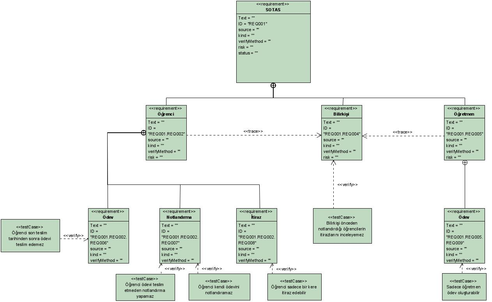
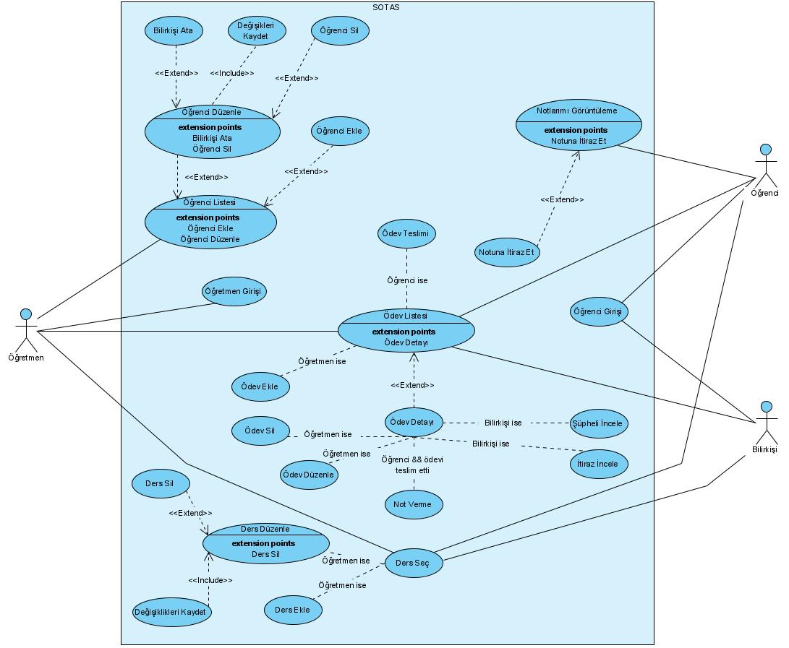
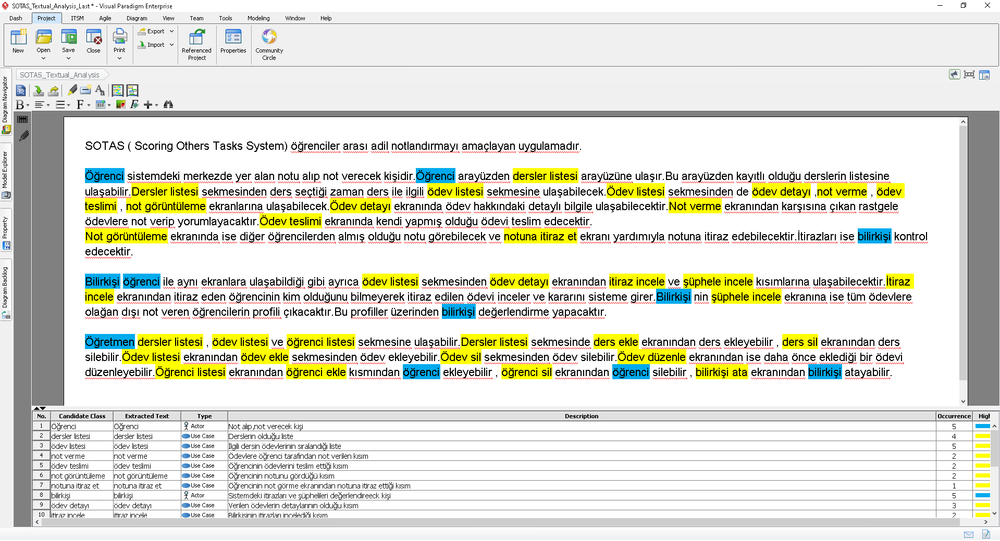

---
title:
- SOTAS (Scoring Others' Tasks System)
output:
  beamer_presentation:
    theme: "AnnArbor"
    colortheme: "dolphin"
    fonttheme: "structurebold"
date:
- Ekim 26, 2021 - İlk Sunum

---

# Problem

- Sınıfta çok fazla öğrenci var
- Öğretmenin herbir öğrencinin ödevini kontrol etmesi kolay değil
- Öğrencilerin, diğer öğrencilerden ödevleri için geri dönüş alabilecekleri bir ortam bulunmuyor

# Çözüm

- Ödevleri öğrenciler kendi aralarında değerlendirecek ve notlandıracak
- Öğretmen sadece ödevleri belirleyecek, ihtiyaç halinde notlandırmaya müdahale edebilecek

# SOTAS Nedir?

## Scoring Others' Tasks System

SOTAS, klasik not verme sistemine alternatif daha kolay ve adil bir çözüm
getirme hedefini taşır. Yazılım, dağıtık not verme sistemi mantığını kullanır
ve bu sayede öğrencilerin de öğretim görevlisinin yerine not verme sürecine
katılmasını amaçlar.

# Kullanılan Teknolojiler

### Backend
    - JAVA
    - Quarkus
    - GraalVM
    - SQLite

### Frontend
    - Angular
    - Typescript
    - HTML
    - CSS, SCSS

### Workflow
    - Jetbrains Spaces
    - Git
    - Discord

# Requirement Diagramı

# Use-Case Diagramı

# Textual Analysis

# Ekip Olarak Projeyi Nasıl Yürütmeyi Planlıyoruz?

20 kişi oldukça fazla bir sayı ve doğru şekilde kordine olunması gerekiyor.
Bunun için ekibimizi mikro ekiplere bölmeyi kararlaştırdık. Frontend ve Backend
şeklinde iki ana grup ve onların içinde bulunan iki veya üçer kişilik gruplardan
oluşturduk.
