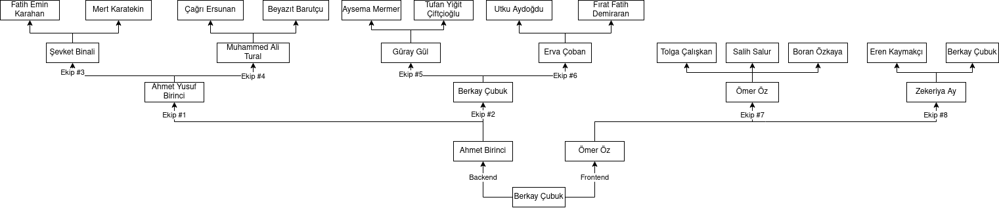
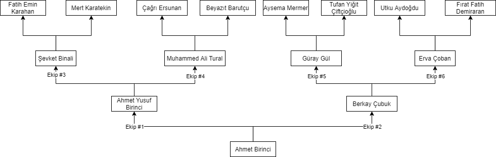
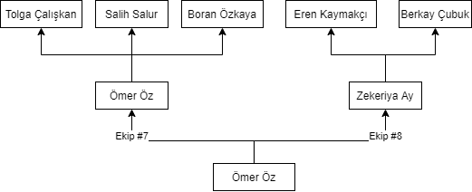
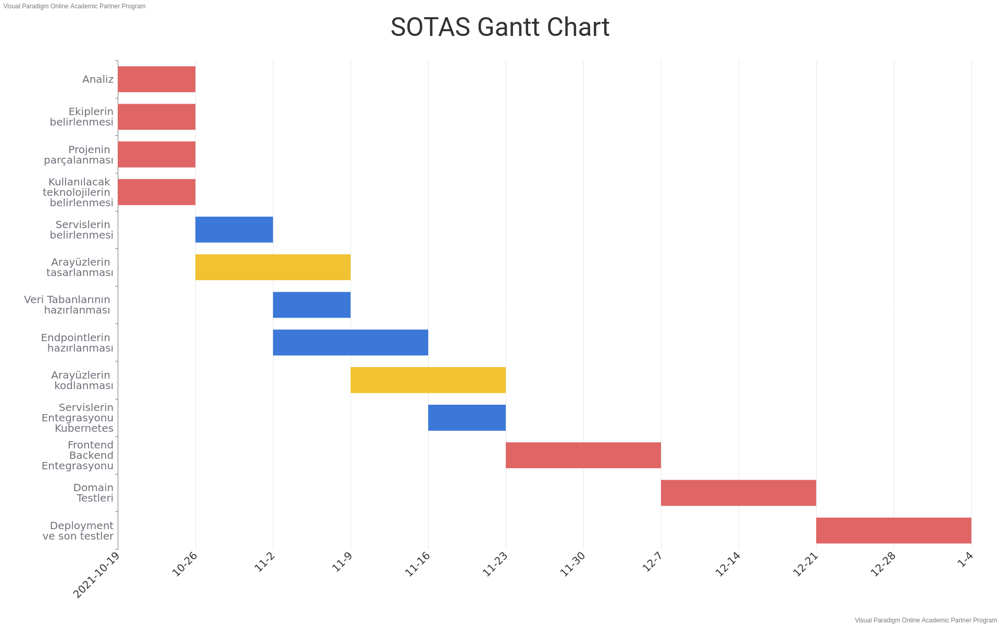

---
title:
- SOTAS (Scoring Others' Tasks System)
output:
  beamer_presentation:
    theme: "AnnArbor"
    colortheme: "dolphin"
    fonttheme: "structurebold"
date:
- Kasım 2, 2021

---

# Organizsayon Şeması

# Backend Ekip Şeması

# Frontend Ekip Şeması

# Gantt Şeması

# Grup İçi Notlandırma Yöntemi

- Proje içerisinde yapılması gereken işler GitHub üzerinde yapacak kişilere atanıyor

- Atanan işlerin belirli bir bitiş süresi ve karşılaması gereken şartları bulunuyor

- GitHub üzerinde herkesin erişimine açık olan bir dosya üzerinde her kişinin tamamladığı iş sayısı ve tamamlanan işlerin
1'den 5'e kadar olacak şekilde değerlerinin toplamı yazacak

- Her haftalık hedef sonrasında bu tablo gereken değerler ile işlenecek ve kayıt altına alınacak

- Proje bitiminde herkesin yaptığı işler dizilecek ve bir sıralama oluşturulacak

- Oluşturulan sıralamaya göre de ortak bir şekilde herkese not verilecek

- Verilen notlar sonucu istenen şartlar karşılanana kadar tekrar notlandırma yapılacak

# DevOps Dokümantasyonu

## Nedir bu DevOps?

DevOps, fikirlerin production'a deploylanmasından çıkan problemlerden ders alınmasına kadarki
süreçtir.

# DevOps Dokümantasyonu

## Neden DevOps?

Bir projeyi master branch üzerinde bir commit ile tamamlamak her ne kadar cazip gözüksede
bizce bir katliamdır. Bir projeyi ekip halinde gerçekleştirecek ve yaşatmaya devam edeceksek
kimin ne yapacağı, nasıl yapacağı ve neler olacağı çok önemlidir. DevOps bu noktada bize 
yardımcı olmaktadır.

# DevOps Dokümantasyonu

## 0'dan Sonuca Süreç

### Issue Oluşturma

Geliştirmek veya eklenmek istenen özellik hakkında halihazırda bulunan issue templatelerinden yararlanarak
detaylı bir issue oluşturulmalıdır. Oluşturulan issue:

- En az 1 kişiye atanmalı

- Uygun label'ı içermeli

- Bir projeye bağlanmalı

- Uygun milestone'a bağlanmalı

# DevOps Dokümantasyonu

### Issue Üzerinde Çalışmaya Başlama

Üzerinde çalışmak istediğiniz issue ilk olarak proje içerisinde **Todo**'dan **In Progress**'e  alınmalıdır
ki ekibin kimin şu anda ne yaptığıyla ilgili genel bir fikri olabilsin.

Eğer bu issue ile ilk defa çalışmaya başlandıysa ona ait bir branch oluşturulmalı. Branch adı dokümantasyonlar için
**doc-issueKodu**, frontend için **f-issueKodu** ve backend için **b-issueKodu** olmalıdır. Issue kodları
başlığın yanında bulunan # işaretiyle başlayan sayılardır.

# DevOps Dokümantasyonu

### Testler

Projelerin can damarı olan testler koda girişmeden önce belirlenmeli ve yazılmalıdır. Yazılmış olan testler karşılandığında
pull request açılabilir ve kimsenin kodu etkilenmeden sürece devam edilebilir.

# DevOps Dokümantasyonu

### Yapılan Çalışmada İlerleme

Yapılan geliştirme hangi konu ile ilgili olursa olsun mutlaka küçük commitler atılarak ilerlenmelidir. Böylelikle
herhangi bir sorunda geriye dönüş kolaylaşmış oluyor.

Issue için belirlenmiş hedefleri karşıladığınızda da ekip liderinizin branchine olacak şekilde veya ihtiyaca
göre master'a olacak şekilde ekip liderinizi reviewer olarak işaretleyip pull request oluşturmalısınız.

Pull request açtığınızda otomatik olarak kodunuz test edilir ve sistem tarafından uygun olup olmadığına karar
verilir. Sistemin uygun görmediği pull requestler tekrardan incelenmeli ve hataları düzeltildikten sonra
tekrar oluşturulmalıdır.

# DevOps Dokümantasyonu

### Code Review

Code review sürecinde tamamlamış olduğunuz iş ekip liderinizce kontrol edilir ve uygun görülürse gerekli branch'e eklenir.

Kodu inceleyecek kişinin kodu anlayabilmesi de sağlıklı ilerleyebilmek için çok kritiktir. Bu noktada temiz ve anlaşılır 
kod yazmak önemlidir.

Onaylanmış olmasına rağmen ileriki süreçte hata çıkaran pull requestlerin sorumluluğu code review yapan kişiyle
pull request isteğini açan kişidedir. Bu sebeple kodları inceleyecek arkadaşların emin olduktan sonra merge
etmeleri kendileri için ve proje için büyük öneme sahiptir.

# DevOps Dokümantasyonu

### Deployment

Her repositorynin master (veya main) branch'i o projenin son halini temsil eder ve çalışabilir durumda olmalıdır.
Otomatik deployment sayesinde ana branchlerde bir değişiklik yapıldığında demo sunucularına deploy edilir.

# Otomasyon İçin Kullanılacak Yapılar

## GitHub

- Kanban board ve milestonelar

- Issue adını verdiğimiz gerek yeni özellik ekleyebildiğimiz gerekirse de mevcut olan özellikler üzerinde değişiklik yapabildiğimiz ve
buradan proje kanban tablosuna yönlendirebildiğimiz yapılar

- Actions adında bizim özel bir şekilde yazabildiğimiz veya mevcut olan ve önceden yazılmış şemaları kullanabildiğimiz
pipeline

- Discord ile entegre olup canlı bildirimler

- Pull Requestler ile code review ve yorum yapma olanağı

# Otomasyon İçin Kullanılacak Yapılar

## CircleCI

- GitHub Actionlar'ın yetersiz kaldığı noktada geçiş yapmayı planlıyoruz

- Aylık 6000 saate kadar build süresi sunuyor

# Otomasyon İçin Kullanılacak Yapılar

## CodeFactor

- Kod kalitesini ölçebiliyor

- Issue'lar için öneri sunuyor

# Otomasyon İçin Kullanılacak Yapılar

## Otomatik Testler

- Angular ve Quarkus içerisinde bulunan test yapıları

# Otomasyon İçin Kullanılacak Yapılar

## Netlify

- Frontend uygulamalarımızı GitHub ile entegre şekilde deploy etmek için

# Test Stratejisi

## Kapsam

- SOTAS projesinde tüm ekip üyeleri geliştirme, düzenleme veya ekleme yaparken
test yazmakla sorumludur.
- Önceden kararlaşıtırılmış veya beklenmedik durumlar dışında yapılan tüm pull requestlerin
code reviewları üyelerin ekip liderlerince yapılmalıdır. Ör: Ekip 1 içerisindeki tüm üyeler
ekip Ekip 1 liderine code review yaptırmalıdır. Ekip 1'in üstündeki ekibe ise Ekip 1'in lideri
pull request açıp üst ekip liderine kodları onaylatmalıdır.
- Gerek frontend gerekse de backend geliştirmeleri yapılırken ilk olarak yapılan geliştirme
için test yazılmalıdır. Test yazılmadan kabul edilen code reviewlardan ekip liderleri
sorumlu olacaktır.

# Test Stratejisi

## Yaklaşım

- Yapılan her geliştirme için problemi kapsayacak kadar unit test yazılmalıdır.
- Çeşitli servislerin, 3. parti API'ların ve sistemin entegrasyonunu kontrol edebilmek
için belli aralıklarla smoke testler, performance testleri ve integration testleri
yazılabilir.

# Test Stratejisi

## Ortam

- Her bir veritabanı modeli için seeder yazılmalı ve hangi ortamda test yapılırsa yapılsın
bu seederlar ile veri üretilmelidir.
- Mikroservislerin teker teker testi için Docker yüklü ve çalışıyor olan herhangi bir
cihaz üzerinde testler yapılabilir.
- Pull Request yapıldığında önceden belirlenmiş olan pipeline üzerinden automated testler
çalıştırılır. Linux tabanlı cihazlar tercih edilmelidir.
- Kritik dosyalar ve veritabanları herhangi bir testten önce mutlaka yedeklenmelidir ki
herhangi bir veri kaybı yaşanmasın.

# Test Stratejisi

## Araçlar

- Test yazarken kullanılan frameworkün sunmuş olduğu test yapısı kullanılmalıdır. Özellikle
unit testlerin proje ile tam entegre olması beklenir.
- Load testing ve proje bütününün testlerinde aracı programlar kullanılabilir ve kullanılmalıdır.

# Test Stratejisi

## Yayınlama

- Herhangi bir test içermeyen veya hata veren testleri bulunan pull requestler kesinlikle
kabul edilemez. Çözmek istenen probleme uygun test mutlaka ve mutlaka yazılmalıdır.
- Testleri başarıyla geçen pull requestler ekip liderlerince projeye merge edilebilir.

# Dokümanlarımız Açık Kaynaklı

